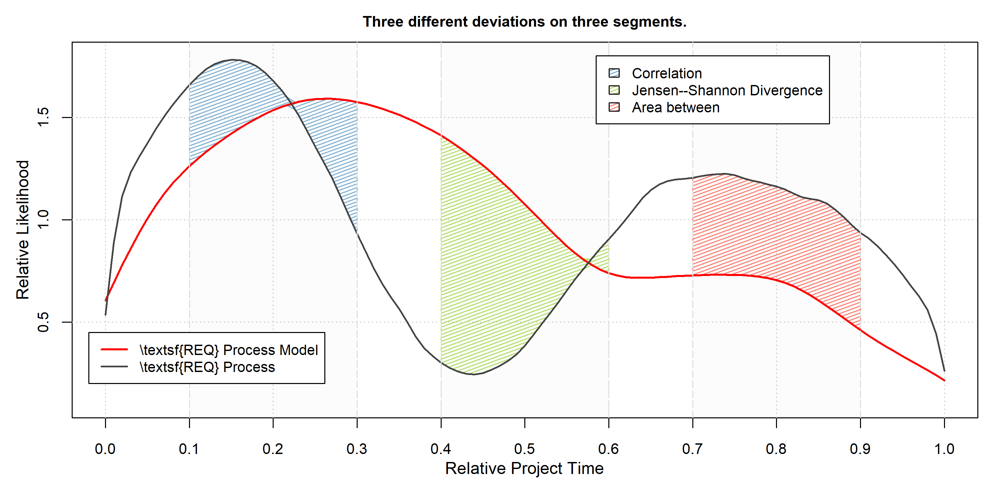

- [Preface](#preface)
- [Source code density Expectation and Standard deviation](#source-code-density-expectation-and-standard-deviation)
- [Effective Training on Scarce Data](#effective-training-on-scarce-data)
- [Automatic Calibration](#automatic-calibration)
  - [Loading the Weighted Mixtures](#loading-the-weighted-mixtures)
  - [Prepare for Scoring](#prepare-for-scoring)
  - [Calibration](#calibration)
    - [Summary](#summary)
  - [Dataset Preparation](#dataset-preparation)
    - [Create the Dataset](#create-the-dataset)
    - [Rank-transform](#rank-transform)
  - [Regression Tests and Rank-transforms](#regression-tests-and-rank-transforms)
    - [LOOCV Using the Ordinary Dataset](#loocv-using-the-ordinary-dataset)
    - [LOOCV Using the Scores Dataset](#loocv-using-the-scores-dataset)
    - [Rank-transforms](#rank-transforms)
- [References](#references)

# Preface

This notebook represents the replication package for my dissertation
([Hönel 2023a](#ref-honel2023_phdthesis)). Rendering this notebook will
exactly reproduce all results, figures, and tables as used therein. Some
data was taken from a technical report ([Hönel
2023b](#ref-honel2023_fdtr)) and reused here.

# Source code density Expectation and Standard deviation

``` r
temp <- read.table("../data/360k_density.csv", header = TRUE)
quantile(temp$Density, probs = sort(c(0.065, seq(0, 0.7, by = 0.1), 0.72504)))
```

    ##       0%     6.5%      10%      20%      30%      40%      50%      60% 
    ## 0.000000 0.500000 0.566670 0.683206 0.753724 0.809520 0.857140 0.906120 
    ##      70%  72.504% 
    ## 0.966100 1.000000

``` r
projects_sc <- readRDS(file = "../data/projects_sc.rds")$projects_sc
```

``` r
scd_vals <- c()
scd_means <- c()
use_x <- seq(from = 0, to = 1, length.out = 1e+05)

for (pname in names(projects_sc)) {
  scd_vals <- c(scd_vals, projects_sc[[pname]]$SCD(use_x))
  scd_means <- c(scd_means, cubature::cubintegrate(f = projects_sc[[pname]]$SCD,
    lower = 0, upper = 1)$integral)
}

`names<-`(x = c(mean(scd_vals), mean(scd_means), sd(scd_vals)), value = c("mean",
  "mean (integral)", "sd"))
```

    ##            mean mean (integral)              sd 
    ##       0.7991963       0.7991868       0.1897813

# Effective Training on Scarce Data

<figure>

<figcaption aria-hidden="true">Continuous confidence of the neural
network predictor, with regard to number of training instances. Shown
are the values according to the 68-95-99.7%-rule (assuming a normal
distribution for every generalization error). The mean RMSE was
determined using 50 models’ predictions on validation data. The three
color gradients correspond to the three sigmas.</figcaption>
</figure>

# Automatic Calibration

We want to show some preliminary results for *Automatic Calibration* in
the thesis. Previously, we have applied the rank transform to develop a
sort of scoring mechanism using joint cumulative probabilities ([Ulan et
al. 2018](#ref-ulan2018_qmio)). Most recently, the *rank transform* of
this approach has been generalized by allowing to use any value as ideal
value ([Hönel et al. 2022](#ref-honel2022_qrs)).

For the thesis, I want to show a concrete example based on project
management. For that, I will use some of the activities as were
previously derived from an average manifestation of the Fire Drill using
weighted mixtures ([Hönel et al. 2023](#ref-honel2023_ecs)). Over the
(normalized) project time, we now have a probability distribution for
each activity. There are six activities, three for source code and three
for issue-tracking. We could say that the weighted mixtures represent a
“process model” for the Fire Drill, from a quantitative perspective.
However, I would not go this far at this point and call it a pattern,
but rather a *typical accumulation*. It would perhaps become a reliable
process model if we were to add many more observations of projects that
were affected by the Fire Drill in some degree.

## Loading the Weighted Mixtures

Nevertheless, for the sake of demonstrating automatic calibration, we
will take the weighted mixtures and use an approximation of these and
call it a process model here. Figure shows the weighted mixture for each
activity, as well as a simplified/smoothed version. We will pick one or
two of these activities for demonstrating automatic calibration.

``` r
# Let's load the weighted mixtures:
weighted_mixtures <- readRDS("../data/weighted_mixtures.rds")
```

``` r
rejection_sampling <- function(x_data, y_data, xlim = c(0, 1), num_x = 1000) {
  tempf <- stats::approxfun(x = x_data, y = y_data, yleft = 0, yright = 0)  #, rule = 2)
  use_x <- seq(from = xlim[1], to = xlim[2], length.out = num_x)
  use_y <- stats::runif(n = length(use_x), min = 0, max = max(y_data))
  use_x[use_y <= tempf(use_x)]
}


gaussian_kde_pdf <- function(data) {
  # Closed-form Gaussian KDE PDF:
  use_bw <- bw.SJ(x = data)
  kde_pdf <- Vectorize(function(x, h = use_bw) {
    1/(length(data) * h) * sum(dnorm((x - data)/h))
  })

  # Cut the PDF so its integral [0,1] = 1
  the_int <- cubature::cubintegrate(f = kde_pdf, lower = 0, upper = 1, maxEval = 10000)$integral
  return(function(x) {
    kde_pdf(x)/the_int
  })
}


make_smooth_dens <- function(org_densf, domain = c(0, 1), npoints = 15, span = 0.3) {
  use_x <- seq(from = domain[1], to = domain[2], length.out = npoints)
  y <- org_densf(use_x)
  temp <- stats::loess.smooth(x = use_x, y = y, span = span, family = "g", evaluation = 1000)

  # Rejection-sampling from this curve:
  rej_samples <- rejection_sampling(x_data = ((temp$x - min(temp$x))/(max(temp$x) -
    min(temp$x))), y_data = temp$y)

  gaussian_kde_pdf(rej_samples)
}
```

<figure>

<figcaption aria-hidden="true">Weighted mixtures for all source code and
issue-tracking activities.</figcaption>
</figure>

## Prepare for Scoring

I think we should select the smoothed density for $\mathsf{REQ}$ from
Figure as it makes for a good example. Automatic calibration requires a
(representative) sample of the space of all possible outcomes. The
larger the sample, the more accurate the scores will be. So, what we
require here, is a set of $\mathsf{REQ}$ activities **as they might
occur in real-life**. This is the point where one would either gather
all observed instances or try to simulate them. We will do the latter.
As we have no expectation as to how this activity might unfold in a
random project, we will just generate random continuous probability
distributions.

The next step is then to select and compute features. The features
should quantify the difference between the process model and any
simulated process. For simplicity, we will compute the **area**,
**correlation**, and **symmetric Jensen–Shannon divergence** between
process and -model, and we will do so on a few selected segments. This
will allow us then later to inspect individual scores for previously
unseen processes. Let’s say we simulate ten thousand processes, then we
will get a data frame with ten thousand rows and some columns (metric
per $n$th-segment $1\ldots n$).

The second requirement for automatic calibration is an **ideal value**
that allows us to transform any feature $F_i$ into a distance $D_i$. We
will do this using the absolute value function. For an ideal value
$d_i$, we obtain $D_i=\left\lvert\,\left(F_i-d_i\right)\,\right\rvert$.
This distribution (and esp. its (C)CDF) is then used to transform and
(non-)linearly scale a feature to become a score. Since our features are
distances (from the ideal), the scores based thereon will have the
meaning *larger is better*. The *utopian* ideal value is for a
*correlation* is $\bm{1}$, and for the area between it is $\bm{0}$. For
the Jensen–Shannon divergence, it is $\bm{\infty}$, since we transform
its values using the negative logarithm. However, for practical reasons,
we will use the largest value observed during automatic calibration, as
it is unlikely to observe a smaller value in practice, given that we
drew many samples.

## Calibration

Now for the actual calibration. Let’s generate a few thousand random
processes and compute their segment-wise correlation with the smoothed
$\mathsf{CP}$ activity.

First, we’ll define some helper functions.

``` r
get_smoothed_curve <- function(seed, npoints = 15, span = 0.35) {
  if (is.na(seed)) {
    stop("A seed is required.")
  }
  set.seed(seed = seed)

  x <- sort(c(0, 1, runif(n = npoints - 2)))
  y <- runif(n = length(x), min = 0, max = 1)
  temp <- loess.smooth(x = x, y = y, span = span, family = "g", evaluation = 1000)

  # Rejection-sampling from this curve:
  rej_samples <- rejection_sampling(x_data = ((temp$x - min(temp$x))/(max(temp$x) -
    min(temp$x))), y_data = temp$y)

  gaussian_kde_pdf(rej_samples)
}


jsd_segment <- function(p, q, ext = c(0, 0.1), xtol = 1e-20) {
  cubature::cubintegrate(f = function(x) {
    p_ <- p(x)
    q_ <- q(x)
    m_ <- 0.5 * (p_ + q_)
    tryCatch({
      if (abs(p_) < xtol || abs(q_) < xtol || abs(m_) < xtol)
        0 else 0.5 * p_ * log(p_/m_) + 0.5 * q_ * log(q_/m_)
    }, warning = function(w) {
      stop(paste0(p(x), " ; ", q(x), " ; ", m_))
    })
  }, lower = ext[1], upper = ext[2], maxEval = 1000)$integral
}
```

``` r
use_activity <- "REQ"
pm <- make_smooth_dens(org_densf = weighted_mixtures[[use_activity]])  # Process Model

seg_starts <- c(0.1, 0.4, 0.7)
seg_len <- 0.2

ac_features <- NULL

for (use_feature in c("area", "corr", "jsd")) {
  ac_features <- rbind(ac_features, loadResultsOrCompute(file = paste0("../results/ac_features-",
    use_feature, ".rds"), computeExpr = {
    doWithParallelCluster(expr = {
      library(foreach)
      foreach::foreach(seed = seq(from = 1337, length.out = 10000), .combine = rbind,
        .inorder = FALSE) %dopar% {
        proc = get_smoothed_curve(seed = seed, npoints = 14, span = 0.35)

        temp <- matrix(nrow = 1, data = sapply(X = 1:length(seg_starts),
          FUN = function(seg_idx) {
          # the segment
          a <- seg_starts[seg_idx]
          b <- a + seg_len
          use_x <- seq(from = a, to = b, length.out = 500)

          if (use_feature == "area") {
            # Area between:
            mean(abs(pm(use_x) - proc(use_x))) * (b - a)
          } else if (use_feature == "corr") {
            # Correlation:
            temp <- suppressWarnings({
            stats::cor(x = pm(use_x), y = proc(use_x))
            })
            if (is.na(temp))
            0 else temp
          } else if (use_feature == "jsd") {
            # JSD:
            jsd_segment(p = pm, q = proc, ext = c(a, b))
          }
          }))

        cbind(data.frame(seed = seed, feat = use_feature, seg_len = seg_len,
          seg_starts = paste0(seg_starts, collapse = ","), stringsAsFactors = FALSE),
          `colnames<-`(x = temp, value = paste0("seg_", 1:length(seg_starts))))
      }
    })
  }))
}
```

In Figure we show the PDF and CDF as approximated using kernel density
estimation with Gaussian kernels. The bandwidth used is “SJ” ([Sheather
and Jones 1991](#ref-sj1991bandwidth)). In that figure, the number of
samples increases with each row, from $5$ to $10,000$. While for
relatively few sample the PDF/CDF change more drastically, the
differences between large and very large sample sizes increasingly
vanish.

<figure>

<figcaption aria-hidden="true">PDF and CDF for the three features as
they get approximated with increasing sample sizes using Gaussian
KDE.</figcaption>
</figure>

### Summary

Here, we will generate two figures. In the first one, we show the
Automatic Calibration of the three metrics after a fixed number of
epochs. In the second, we summarize Figure into a new figure to be used
in the dissertation.

``` r
# In this function, we create the AC plot after n observed processes.
make_ac_plot <- function() {
  rlang::expr({
    cex <- if (paper)
      0.9 else 1
    mline <- if (paper)
      2 else 3
    lline <- if (paper)
      2 else 2.75

    if (paper) {
      # 5.1 4.1 4.1 2.1
      par(mar = c(4.1, 3.6, 2.1, 1.1))
    }

    use_ylim <- 2.8

    curve2(func = pm, from = 0, to = 1, lwd = 2, col = "#FF4A36", main = paste0("Automatic Calibration after ",
      n, " epochs."), xlab = "", ylab = "", xaxt = "n", yaxt = "n", ylim = c(0.05,
      use_ylim), cex.main = cex, cex.lab = cex, cex.axis = cex)

    mtext(text = "Relative Project Time", side = 1, line = mline, cex = cex)
    mtext(text = "Relative Likelihood", side = 2, line = mline, cex = cex)
    axis(1, at = seq(0, 1, by = 0.1), cex.axis = cex)
    axis(2, at = seq(0, use_ylim, by = 0.2), cex.axis = cex)

    polygon_colors <- RColorBrewer::brewer.pal(12, "Set3")[c(4, 5, 7)]

    for (idx in 1:n) {
      rp <- get_smoothed_curve(seed = idx, npoints = 14, span = 0.35)
      for (fidx in 1:length(feat_seg)) {
        f <- names(feat_seg)[fidx]
        a <- seg_starts[feat_seg[f]]
        b <- a + seg_len
        use_x <- c(seq(from = a, to = b, length.out = 25))
        use_x <- c(use_x, rev(use_x))

        polygon(x = use_x, y = c(sapply(X = head(use_x, length(use_x)/2),
          FUN = function(x) {
          max(pm(x), rp(x))
          }), sapply(X = tail(use_x, length(use_x)/2), FUN = function(x) {
          min(pm(x), rp(x))
        })), col = if (idx == n)
          polygon_colors[fidx] else "#eeeeeef8", density = if (idx == n)
          30 else 100, angle = if (idx == n)
          20 else 0)
      }
    }

    for (idx in 1:n) {
      rp <- get_smoothed_curve(seed = idx, npoints = 14, span = 0.35)
      curve2(func = rp, from = 0, to = 1, lwd = if (idx == n)
        2 else 1.25, add = TRUE, col = if (idx == n)
        "#444444" else "#bbbbbb")
    }

    # Let's always over-draw the original proc:
    for (fidx in 1:length(feat_seg)) {
      f <- names(feat_seg)[fidx]
      a <- seg_starts[feat_seg[f]]
      b <- a + seg_len
      abline(v = c(a, b), lty = 5, col = "#dddddd")
    }
    curve2(pm, 0, 1, lwd = 3, col = "#FF4A36", add = TRUE)
    grid()

    legend(x = 0.44, y = use_ylim - 0.025, legend = c("Process Model", "Process",
      "Simulated Processes"), bg = "white", cex = cex, col = c("red", "#444444",
      "#bbbbbb"), lwd = c(2, 2, 1.25), lty = 1)
  })
}
```

In Figure we show how the automatic calibration may look after some
epochs. In each epoch, a random process is drawn and the deviations
against the process model are computed.

``` r
n <- 2
paper <- FALSE
eval(make_ac_plot())
```

<figure>

<figcaption aria-hidden="true">The process of Automatic Calibration,
where the process model and deviations are calibrated using random
processes.</figcaption>
</figure>

Let’s also make the summary of Figure . We will group each deviation’s
PDF and CDF into one plot and then show three to four rows of plots
after some $n$ random processes. The result is shown in Figure .

<figure>

<figcaption aria-hidden="true">Summary of the PDF and CDF for the three
features for samples sizes of <span
class="math inline"><em>n</em> = {10, 20, 50, 10<sup>4</sup>}</span>.</figcaption>
</figure>

## Dataset Preparation

We want to show the original dataset (using the raw features) and the
same dataset, processed into scores using the CCDFs from the previous
calibration. We show only a simplified dataset, in which we measure the
correlation on the first segment ($[0.1,0.3]$), the symmetric
Jensen–Shannon divergence on the second segment ($[0.4,0.6]$), and the
area between the curves on the third segment ($[0.7, 0.9]$). Also, the
dataset will only include the chosen activity, $\mathsf{REQ}$, and will
be generated for all $15$ projects.

We will import the issue-tracking project data and create proper
densities first, before creating the dataset.

``` r
pnames_it <- paste0("Project", 1:15)
projects_it <- loadResultsOrCompute(file = "../data/projects_it.rds", computeExpr = {
  projects_it <- list()

  set.seed(1)
  for (pname in pnames_it) {
    temp <- readxl::read_excel(path = "../data/FD_issue-based_detection.xlsx",
      sheet = pname)
    use_y <- as.numeric(temp[[tolower(use_activity)]])
    use_y[is.na(use_y)] <- 0
    tempdens <- density(x = temp$`time%`, weights = use_y/sum(use_y), bw = "SJ",
      cut = TRUE)
    rej_samples <- rejection_sampling(x_data = tempdens$x, y_data = tempdens$y,
      num_x = 1e+05)

    templ <- list()
    templ[[use_activity]] <- gaussian_kde_pdf(rej_samples)
    projects_it[[pname]] <- templ
  }
  projects_it
})
```

### Create the Dataset

Now as for the actual dataset, we will compute the same metrics on the
same segments as were used for the automatic calibration. Here, however,
we compute these for every project’s activity against the process model
used in AC.

``` r
use_feats <- c("area", "corr", "jsd")
ac_dataset <- loadResultsOrCompute(file = "../data/ac_dataset.csv", computeExpr = {
  ac_dataset <- data.frame(matrix(nrow = 0, ncol = 3))

  for (pname in names(projects_it)) {
    proc <- projects_it[[pname]]$REQ
    tempm <- matrix(nrow = 1, ncol = 3)

    for (f_idx in 1:length(use_feats)) {
      f <- use_feats[f_idx]
      # the segment
      seg_idx <- feat_seg[f]
      a <- seg_starts[seg_idx]
      b <- a + seg_len
      use_x <- seq(from = a, to = b, length.out = 500)

      tempm[1, f_idx] <- if (f == "area") {
        mean(abs(pm(use_x) - proc(use_x))) * (b - a)
      } else if (f == "corr") {
        temp <- suppressWarnings({
          stats::cor(x = pm(use_x), y = proc(use_x))
        })
        if (is.na(temp))
          0 else temp
      } else if (f == "jsd") {
        jsd_segment(p = pm, q = proc, ext = c(a, b))
      }
    }

    ac_dataset <- rbind(ac_dataset, tempm)
  }
  `colnames<-`(x = ac_dataset, value = use_feats)
})
```

Let’s show the z-standardized data in Table . These are the raw features
for each project, with mean equal to zero and unit-variance
(z-standardized). It becomes apparent that we cannot comprehend this
data at all, but it is often fed into regression models in exactly this
shape.

|           |       area |       corr |        jsd |
|:----------|-----------:|-----------:|-----------:|
| Project1  | -0.9433345 | -0.0686339 | -0.5993286 |
| Project2  |  0.6530556 | -1.1755413 | -0.6183653 |
| Project3  | -0.9288336 |  0.7804989 | -0.7059629 |
| Project4  | -0.5288444 |  0.8658606 | -0.4777639 |
| Project5  |  1.0155921 |  0.7343981 |  1.3291738 |
| Project6  | -1.3072461 |  0.6390729 | -0.4645270 |
| Project7  |  0.6205945 |  0.6541507 | -0.4444149 |
| Project8  |  0.8599026 |  0.8229561 |  0.3403076 |
| Project9  |  0.0805361 | -0.1769141 | -0.6195441 |
| Project10 | -0.7691970 |  0.8049258 | -0.6593379 |
| Project11 | -0.7740177 | -1.6647565 |  1.5307945 |
| Project12 |  1.0713418 |  0.8329111 | -0.5409142 |
| Project13 | -0.0506469 |  0.0964508 | -0.3592558 |
| Project14 | -1.0531002 | -1.7976421 | -0.2753536 |
| Project15 |  2.0541977 | -1.3477372 |  2.5644921 |

Z-standardized data of three features for the activity REQ.

### Rank-transform

We have previously carried out the automatic calibration and collected
many observations for each feature in each of the defined segments. We
are now ready to extract the CCDFs and transform the original dataset
into a dataset of scores. Let’s create the CCDFs using each feature’s
ideal value first.

``` r
feat_ideal <- c(area = 0, corr = 1, jsd = max(-log(ac_features[ac_features$feat ==
  "jsd", paste0("seg_", feat_seg["jsd"])])))
ac_ccdfs <- list()

for (f in use_feats) {
  ac_ccdfs[[f]] <- (function() {
    temp <- ac_features[ac_features$feat == f, ][[paste0("seg_", feat_seg[f])]]
    if (f == "jsd") {
      temp <- -log(temp)
    }
    # Transform using ideal value:
    temp <- abs(temp - feat_ideal[f])
    use_bw <- bw.SJ(x = temp)
    Vectorize(function(x, h = use_bw) 1 - (1/length(temp) * sum(pnorm((x - temp)/h))))
  })()
}
```

<figure>

<figcaption aria-hidden="true">CCDFs for the three features as
calibrated by the automatic calibration.</figcaption>
</figure>

Figure shows the CCDFs associated with each feature. They are used to
transform the dataset into scores, where a higher score indicates a
lower distance to the ideal value. This is shown in Table . This table
allows us now for each project and each metric, to assess how good it
matches the process model in the metric’s segment.

``` r
ac_dataset_scores <- `rownames<-`(x = data.frame(area = ac_ccdfs$area(abs(feat_ideal["area"] -
  ac_dataset$area)), corr = ac_ccdfs$corr(abs(feat_ideal["corr"] - ac_dataset$corr)),
  jsd = ac_ccdfs$jsd(abs(feat_ideal["jsd"] - -log(ac_dataset$jsd)))), value = pnames_it)
```

|           |      area |      corr |       jsd |
|:----------|----------:|----------:|----------:|
| Project1  | 0.8762860 | 0.4514778 | 0.8423945 |
| Project2  | 0.6118475 | 0.3160615 | 0.8645108 |
| Project3  | 0.8741441 | 0.7264141 | 0.9710326 |
| Project4  | 0.8119183 | 0.8336302 | 0.7076603 |
| Project5  | 0.5563884 | 0.6835820 | 0.0675976 |
| Project6  | 0.9274622 | 0.6140238 | 0.6939151 |
| Project7  | 0.6168880 | 0.6237632 | 0.6735361 |
| Project8  | 0.5799880 | 0.7742224 | 0.2145060 |
| Project9  | 0.7059458 | 0.4390408 | 0.8658989 |
| Project10 | 0.8501137 | 0.7526013 | 0.9136146 |
| Project11 | 0.8508529 | 0.1594599 | 0.0557410 |
| Project12 | 0.5480679 | 0.7870175 | 0.7764839 |
| Project13 | 0.7291590 | 0.4719575 | 0.5929874 |
| Project14 | 0.8922965 | 0.0812977 | 0.5216742 |
| Project15 | 0.4127682 | 0.2801038 | 0.0247922 |

The previous dataset where all features have been transformed to scores.

## Regression Tests and Rank-transforms

Let’s test whether a simple linear model works better with the original
data or with scores. My hypothesis is that it will work better (that
means, lower average validation error) with scores. We will test this
using Leave-one-out Cross-validation ([Lachenbruch and Mickey
1968](#ref-lachenbruch1968Loocv)).

First, we have to load the ground truth.

``` r
ground_truth_all <- rbind(read.csv(file = "../data/ground-truth.csv", sep = ";"),
  read.csv(file = "../data/ground-truth_2nd-batch.csv", sep = ";"))
```

### LOOCV Using the Ordinary Dataset

Here we train a model using the original dataset. We will pre-process
the raw features simply by standardizing them. Table shows the averaged
variable importance.

``` r
predicted <- c()
dataset <- cbind(ac_dataset, data.frame(gt = ground_truth_all$consensus/10))
var_imp <- NULL

for (pId in 1:15) {
  train <- dataset[setdiff(1:15, pId), ]  # LOO dataset
  valid <- dataset[pId, ]

  pre_proc <- caret::preProcess(train[, "gt" != colnames(train)], method = c("center",
    "scale"))
  train <- predict(pre_proc, train)
  valid <- predict(pre_proc, valid)

  model <- lm(formula = gt ~ ., data = train)
  # model <- randomForest::randomForest(gt~., train) model <-
  # neuralnet::neuralnet(formula = gt~., data = train, hidden = c(2,2))
  predicted <- c(predicted, predict(model, valid))

  temp <- caret::varImp(model)/sum(caret::varImp(model))
  # We'll average the variable importance later
  var_imp <- if (is.null(var_imp))
    temp else var_imp + temp
}

print(model$coefficients)
```

    ## (Intercept)        area        corr         jsd 
    ##  0.29285714 -0.05295587  0.09764618 -0.08560357

``` r
print(sqrt(mean((predicted - dataset$gt)^2)))
```

    ## [1] 0.331841

``` r
var_imp <- var_imp/sum(var_imp)
```

|      |   Overall |
|:-----|----------:|
| area | 0.1668226 |
| corr | 0.4816101 |
| jsd  | 0.3515673 |

Averaged variable importance for the trained model.

### LOOCV Using the Scores Dataset

Let’s do the leave-one-out training for every project. Then, in Table ,
we show the variable importance of the trained model.

``` r
predicted <- c()
dataset <- cbind(ac_dataset_scores, data.frame(gt = ground_truth_all$consensus/10))
var_imp <- NULL

for (pId in 1:15) {
  train <- dataset[setdiff(1:15, pId), ]  # LOO dataset
  valid <- dataset[pId, ]

  # This has no effect on a linear model. pre_proc <- caret::preProcess(train[,
  # 'gt' != colnames(train)], method = c('center', 'scale')) train <-
  # predict(pre_proc, train) valid <- predict(pre_proc, valid)

  model <- lm(formula = gt ~ ., data = train)
  # model <- randomForest::randomForest(gt~., train) model <-
  # neuralnet::neuralnet(formula = gt~., data = train, hidden = c(2,2))
  predicted <- c(predicted, predict(model, valid))

  temp <- caret::varImp(model)/sum(caret::varImp(model))
  # We'll average the variable importance later
  var_imp <- if (is.null(var_imp))
    temp else var_imp + temp
}

print(model$coefficients)
```

    ## (Intercept)        area        corr         jsd 
    ##  -0.3548617   0.3824155   0.3731399   0.2511364

``` r
print(sqrt(mean((predicted - dataset$gt)^2)))
```

    ## [1] 0.3258683

``` r
var_imp <- var_imp/sum(var_imp)
```

|      |   Overall |
|:-----|----------:|
| area | 0.1972779 |
| corr | 0.4105723 |
| jsd  | 0.3921497 |

Averaged variable importance for the model trained using scores instead
of standardized features.

### Rank-transforms

Let’s demonstrate raw features vs. z-standardized features vs. scores
for one example. We will pick one project and learn the scaling on the
others. Then, we’ll train a predictive model and evaluate the result
using scores and variable importance.

``` r
dataset <- cbind(ac_dataset, data.frame(gt = ground_truth_all$consensus/10))
use_pid <- 15  # 15, 7, 12
train <- dataset[setdiff(1:15, use_pid), ]
valid <- dataset[use_pid, ]

set.seed(1)
model <- randomForest::randomForest(gt ~ ., train, importance = TRUE, localImp = TRUE,
  mtry = 3)
c(predict(model, valid), valid$gt)
```

    ##         15            
    ## 0.08009333 0.10000000

And the importances are:

``` r
tempdf <- as.data.frame(model$importance)
(temp_imp <- `names<-`(x = abs(tempdf$`%IncMSE`)/sum(abs(tempdf$`%IncMSE`)), values = rownames(tempdf)))
```

    ##     area     corr      jsd 
    ## 0.136584 0.300872 0.562544

<figure>

<figcaption aria-hidden="true">Correlation, Jensen–Shannon divergence,
and area between for the process model (REQ) vs. a process.</figcaption>
</figure>

Figure shows an example of measuring the deviation between a process
model and a process. Table then shows the original feature’s data, the
scaled data, and the scores for this example.

|             |      area |       corr |       jsd |
|:------------|----------:|-----------:|----------:|
| Raw Feature | 0.0828000 | -0.5945901 | 0.0174872 |
| Z-scaled    | 2.5775021 | -1.4996054 | 3.7569096 |
| As Score    | 0.4127682 |  0.2801038 | 0.0247922 |

Raw features, Z-standardized features, and Scores for the same
deviations.

``` r
# We get the 'mean' score using the sum, because the weights already sum to 1!
sum(`names<-`(x = as.numeric(temp_imp * ac_dataset_scores[use_pid, ]), value = colnames(ac_dataset_scores)))
```

    ## [1] 0.1545996

``` r
# These are the weighted scores:
`names<-`(x = as.numeric(temp_imp * ac_dataset_scores[use_pid, ]), value = colnames(ac_dataset_scores))
```

    ##       area       corr        jsd 
    ## 0.05637754 0.08427540 0.01394670

# References

<div id="refs" class="references csl-bib-body hanging-indent">

<div id="ref-honel2023_phdthesis" class="csl-entry">

Hönel, Sebastian. 2023a. “<span class="nocase">Exploiting Automatic
Change Detection in Software Process Evolution for Organizational
Learning</span>.” PhD thesis, Linnaeus University.

</div>

<div id="ref-honel2023_fdtr" class="csl-entry">

———. 2023b. “Technical Reports Compilation: Detecting the Fire Drill
Anti-Pattern Using Source Code and Issue-Tracking Data.” *CoRR*
abs/2104.15090 (January). <https://doi.org/10.48550/arXiv.2104.15090>.

</div>

<div id="ref-honel2022_qrs" class="csl-entry">

Hönel, Sebastian, Morgan Ericsson, Welf Löwe, and Anna Wingkvist. 2022.
“Contextual Operationalization of Metrics as Scores: Is My Metric Value
Good?” In *22nd IEEE International Conference on Software Quality,
Reliability and Security, QRS 2022, Guangzhou, China, December 5-9,
2022*, 333–43. IEEE. <https://doi.org/10.1109/QRS57517.2022.00042>.

</div>

<div id="ref-honel2023_ecs" class="csl-entry">

Hönel, Sebastian, Petr Picha, Morgan Ericsson, Premek Brada, Welf Löwe,
and Anna Wingkvist. 2023. “<span class="nocase">Activity-Based Detection
of (Anti-)Patterns: An Embedded Case Study of the Fire Drill</span>.”
*E-Informatica Software Engineering Journal*.

</div>

<div id="ref-lachenbruch1968Loocv" class="csl-entry">

Lachenbruch, Peter A., and M. Ray Mickey. 1968. “Estimation of Error
Rates in Discriminant Analysis.” *Technometrics* 10 (1): 1–11.
<https://doi.org/10.1080/00401706.1968.1049053>.

</div>

<div id="ref-sj1991bandwidth" class="csl-entry">

Sheather, S. J., and M. C. Jones. 1991. “A Reliable Data-Based Bandwidth
Selection Method for Kernel Density Estimation.” *Journal of the Royal
Statistical Society. Series B (Methodological)* 53 (3): 683–90.
<https://doi.org/10.2307/2345597>.

</div>

<div id="ref-ulan2018_qmio" class="csl-entry">

Ulan, Maria, Sebastian Hönel, Rafael Messias Martins, Morgan Ericsson,
Welf Löwe, Anna Wingkvist, and Andreas Kerren. 2018. “Quality Models
Inside Out: Interactive Visualization of Software Metrics by Means of
Joint Probabilities.” In *2018 IEEE Working Conference on Software
Visualization, VISSOFT 2018, Madrid, Spain, September 24-25, 2018*,
65–75. IEEE. <https://doi.org/10.1109/VISSOFT.2018.00015>.

</div>

</div>
